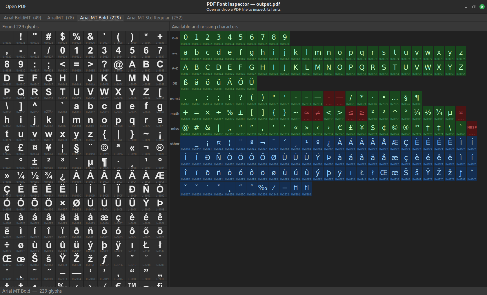

# PDF Font Inspector

Inspect embedded fonts in PDF files — browse font subsets, view glyphs, check character coverage.

<!-- A desktop tool for inspecting embedded fonts in PDF files, inspired by [fontforge](https://fontforge.org/). Browse font subsets, view embedded glyphs rendered in their original shapes, and check character coverage. -->

[](screenshot.png)

## Features

- **Font list** — all fonts embedded in the PDF shown as tabs; each tab shows the font name and glyph count
- **Embedded Glyphs pane** — renders every glyph using the actual font outlines extracted from the PDF
- **Character coverage pane** — visual grid showing which characters are present (green) or missing (red)

## Requirements

```bash
# Install dependencies on Debian/Ubuntu:
sudo apt install python3-gi gir1.2-gtk-3.0 python3-cairo gir1.2-pango-1.0
pip install pymupdf fonttools
```

- Python 3.12+
- GTK 3 + GObject introspection (`python3-gi`, `gir1.2-gtk-3.0`)
- [PyMuPDF](https://pymupdf.readthedocs.io/) (`pymupdf`)
- [fontTools](https://fonttools.readthedocs.io/) (`fonttools`)
- Cairo + PangoCairo (`python3-cairo`, `gir1.2-pango-1.0`)

## Usage

```bash
# Open the app
python3 pdf_fonts.py
# Open the app with file.pdf
python3 pdf_fonts.py file.pdf
```

Open a pdf via button <kbd>Open PDF</kbd> or drop it onto the app. Click on font tabs to view a font's subset glyphs and its character coverage.

## How it works

PDF fonts are subsets that contain glyph outlines but no unicode mapping — that lives separately in the PDF as a `ToUnicode` CMap stream. This tool:
- Parses this stream to build a glyph-to-codepoint map
- Extracts raw font bytes from the PDF using PyMuPDF
- Loads these bytes into fontTools to get glyph outlines
- Renders these outlines directly with Cairo
